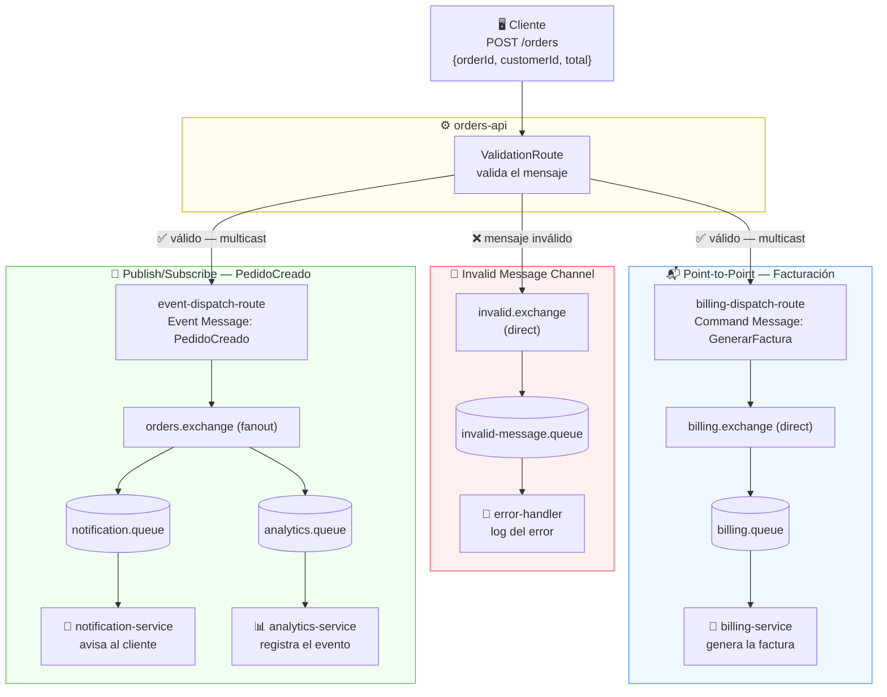

# 🐇 RabbitMQ Patterns — Taller Integración de Sistemas


> Implementación de patrones empresariales de mensajería: **Point-to-Point**, **Publish/Subscribe**, **Command Message**, **Event Message** e **Invalid Message Channel**, usando RabbitMQ + Apache Camel sobre Spring Boot.

---

## 📖 ¿Qué hace este proyecto?

Imagina una **tienda online**. Cuando un cliente hace un pedido, necesitan pasar varias cosas al mismo tiempo:

- 🧾 **Facturación** tiene que generar la factura
- 🔔 **Notificaciones** tiene que avisar al cliente
- 📊 **Analítica** tiene que registrar el evento para estadísticas

El problema: ¿cómo hacemos que estos tres sistemas se enteren del pedido **sin que dependan directamente entre sí**?

La solución: **mensajería asíncrona con RabbitMQ**. El sistema de pedidos publica un mensaje en un broker, y cada sistema interesado lo consume de forma independiente. Si uno cae, los demás siguen funcionando.

---

## 🏗️ Arquitectura



---

## 🎯 Patrones implementados

### 📬 Point-to-Point Channel — Facturación

> **"Un mensaje, un consumidor"**

Cuando llega un pedido válido, se genera un **Command Message** (`GenerarFactura`) que va directamente a `billing.queue`. No importa cuántas instancias de `billing-service` haya corriendo — **solo una procesará cada factura**. Así se evitan facturas duplicadas.

```
Pedido → billing.exchange → billing.queue → [billing-service instancia 1]
                                           → [billing-service instancia 2] ← NO recibe este mensaje
```

### 📢 Publish/Subscribe Channel — PedidoCreado

> **"Un mensaje, todos los suscriptores lo reciben"**

Al mismo tiempo, se publica un **Event Message** (`PedidoCreado`) en `orders.exchange` (tipo **fanout**). RabbitMQ distribuye automáticamente una copia a TODAS las colas suscritas, sin importar cuántas sean.

```
Pedido → orders.exchange (fanout) → notification.queue → [notification-service] ✅
                                  → analytics.queue    → [analytics-service]    ✅
```

### 🚫 Invalid Message Channel — Mensajes inválidos

Antes de cualquier procesamiento, la ruta de validación verifica el mensaje. Si algo falla, va a `invalid-message.queue` en lugar de arruinar el flujo principal.

| Condición de invalidez | Ejemplo |
|---|---|
| Sin `orderId` | `{"customerId":"CLI-001","total":50}` |
| Sin `customerId` | `{"orderId":"ORD-001","total":50}` |
| `total` igual o menor a 0 | `{"orderId":"ORD-001","customerId":"CLI-001","total":0}` |
| JSON malformado | `esto no es json` |

---

## 🔤 Tipos de mensajes

### Command Message — `GenerarFactura`
Le dice a billing-service **qué hacer** (imperativo).

```json
{
  "messageId": "msg-a1b2c3d4",
  "messageType": "GenerarFactura",
  "orderId": "ORD-1001",
  "customerId": "CLI-2001",
  "total": 59.90
}
```

### Event Message — `PedidoCreado`
Informa que algo **ya ocurrió** (pasado). Quien lo reciba decide qué hacer con él.

```json
{
  "eventId": "evt-e5f6a7b8",
  "eventType": "PedidoCreado",
  "occurredAt": "2026-06-03T17:00:00Z",
  "source": "orders-api",
  "payload": {
    "orderId": "ORD-1001",
    "customerId": "CLI-2001",
    "total": 59.90
  }
}
```

---

## 🚀 Cómo ejecutarlo

### Requisitos previos

- Java 21
- Docker + Docker Compose
- Maven (o usar el wrapper `./mvnw`)

### Paso 1 — Levantar RabbitMQ

```bash
docker compose up -d
```

Esto levanta RabbitMQ en:
- **AMQP** (mensajes): `localhost:5672`
- **Management UI**: `http://localhost:15672` → usuario `guest`, contraseña `guest`

### Paso 2 — Iniciar la aplicación

```bash
./mvnw spring-boot:run
```

La API queda disponible en `http://localhost:8080`.

---

## 🧪 Cómo probarlo

### Con curl

**✅ Pedido válido:**
```bash
curl -X POST http://localhost:8080/orders \
  -H "Content-Type: application/json" \
  -d '{"orderId":"ORD-1001","customerId":"CLI-2001","total":59.90}'
```

En los logs del terminal verás:
```
[billing-service]      Procesando factura: {...GenerarFactura...}
[notification-service] Notificacion enviada al cliente: {...PedidoCreado...}
[analytics-service]    Evento registrado para analitica: {...PedidoCreado...}
```

**❌ Pedido sin orderId (inválido):**
```bash
curl -X POST http://localhost:8080/orders \
  -H "Content-Type: application/json" \
  -d '{"customerId":"CLI-2001","total":59.90}'
```

En los logs:
```
[error-handler] Mensaje invalido recibido en invalid-message.queue: 
                {"reason":"orderId es requerido","originalBody":"{...}"}
```

**❌ Total igual a 0:**
```bash
curl -X POST http://localhost:8080/orders \
  -H "Content-Type: application/json" \
  -d '{"orderId":"ORD-999","customerId":"CLI-999","total":0}'
```

### Con Postman

| Campo | Valor |
|---|---|
| Método | `POST` |
| URL | `http://localhost:8080/orders` |
| Content-Type | `application/json` |
| Body | JSON con `orderId`, `customerId`, `total` |

---

## ✅ Tests automáticos

El proyecto incluye **7 tests de integración** que verifican todos los casos del taller:

```bash
# Con RabbitMQ corriendo (docker compose up -d)
./mvnw test
```

```
Tests run: 7, Failures: 0, Errors: 0, Skipped: 0
BUILD SUCCESS
```

| Test | Qué verifica |
|---|---|
| `caso1_facturacion_valida` | billing-service procesa el BillingCommand |
| `caso2_evento_pedido` | notification + analytics reciben PedidoCreado |
| `caso3_sin_orderId` | mensaje sin orderId → invalid-message.queue |
| `caso4_total_cero` | total=0 → invalid-message.queue |
| `json_invalido` | JSON malformado → invalid-message.queue |
| `billing_y_pubsub_simultaneos` | los 3 consumidores activos en paralelo |
| `contextLoads` | el contexto de Spring arranca correctamente |

---

## 📁 Estructura del proyecto

```
rabbitmqpatterns/
├── docker-compose.yml                    # RabbitMQ en Docker
├── docs/
│   ├── arquitectura.mmd                  # Diagrama Mermaid
│   └── informe-tecnico.md                # Documento técnico del taller
└── src/
    └── main/java/com/dermatt/rabbitmqpatterns/
        ├── controller/
        │   └── OrdersController.java     # POST /orders
        ├── model/
        │   ├── OrderRequest.java         # Entrada REST
        │   ├── BillingCommand.java       # Command Message
        │   ├── OrderCreatedEvent.java    # Event Message
        │   └── InvalidMessage.java       # Mensaje de error
        └── routes/
            ├── ValidationRoute.java      # Valida + enruta
            ├── OrdersRoute.java          # Construye y despacha mensajes
            ├── BillingRoute.java         # Consume billing.queue (P2P)
            ├── NotificationRoute.java    # Consume notification.queue (PubSub)
            ├── AnalyticsRoute.java       # Consume analytics.queue (PubSub)
            └── InvalidMessageRoute.java  # Consume invalid-message.queue
```

---

## 🛠️ Tecnologías

| Tecnología | Versión | Rol |
|---|---|---|
| Java | 21 | Lenguaje |
| Spring Boot | 4.0.6 | Framework base |
| Apache Camel | 4.20 | Motor de rutas de integración |
| RabbitMQ | 3-management | Broker de mensajes |
| Docker Compose | — | Infraestructura local |
| Maven | — | Build tool |

---

## 📚 Contexto académico

Taller práctico de la **Semana 8** — materia Integración de Sistemas, UDLA.
Docente: Darío Villamarín G.

Patrones aplicados basados en:
> Hohpe, G. & Woolf, B. (2004). *Enterprise Integration Patterns*. Addison-Wesley.
